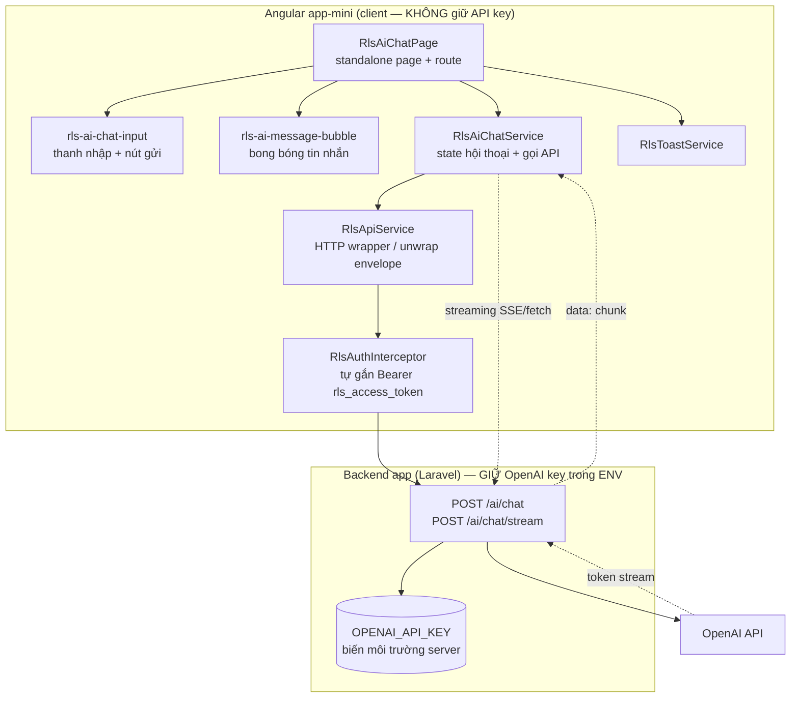
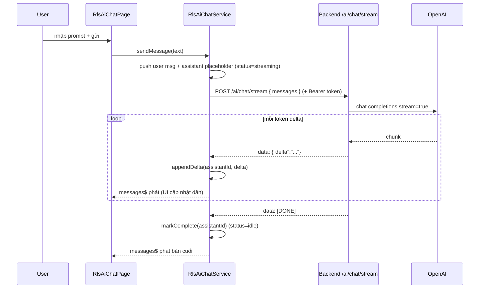
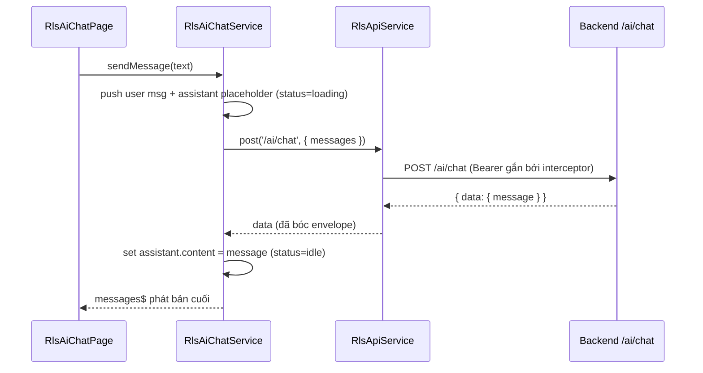

# Design Document: AI Chat Bot (`ai-chatbot`)

## Overview

Tính năng **AI Chat Bot** bổ sung một trang trò chuyện (chat) vào module `app-mini`
(REALTIME LOCAL SOCIAL), cho phép người dùng đặt câu hỏi và nhận trả lời từ một mô
hình ngôn ngữ (OpenAI). Tính năng tuân thủ đúng convention của dự án: một core
service `RlsAiChatService` (gọi backend qua `RlsApiService`), một standalone page
`RlsAiChatPage` với route lazy `/app-mini/ai-chat`, các interface message/conversation
trong `core/interfaces`, và các shared component UI (bong bóng tin nhắn + thanh nhập).

Quyết định kiến trúc cốt lõi — và là **ràng buộc bảo mật bắt buộc**: OpenAI API key
**TUYỆT ĐỐI KHÔNG** xuất hiện trong mã nguồn frontend Angular. Client chỉ gọi tới
backend của chính ứng dụng (`POST /ai/chat`, `POST /ai/chat/stream`); backend giữ
key trong biến môi trường server-side và là bên duy nhất nói chuyện với OpenAI.
Frontend không bao giờ biết, lưu, hay truyền key. Xem [§ Security Considerations](#security-considerations).

Service hỗ trợ hai chế độ phản hồi: **streaming** (SSE/chunked, token hiện dần — trải
nghiệm chat tốt) và **fallback request/response** thường (một lần trả về toàn bộ) khi
backend chưa bật streaming hoặc khi streaming lỗi giữa chừng. State hội thoại được giữ
trong service qua `BehaviorSubject` (mirror `RlsFeedService`), gồm danh sách tin nhắn,
cờ loading/streaming và lỗi gần nhất.

---

## Architecture



**Luồng trách nhiệm**

- `RlsAiChatPage` — render danh sách tin nhắn, bind input, hiển thị trạng thái
  loading/streaming/lỗi. Không gọi HTTP trực tiếp.
- `RlsAiChatService` — nguồn chân lý cho hội thoại (`messages$`, `status$`,
  `error$`), quyết định streaming vs non-streaming, áp các token delta vào tin nhắn
  assistant đang sinh, xử lý hủy (abort).
- `RlsApiService` — điểm vào HTTP non-streaming (bóc envelope `{ data, meta?, message? }`),
  host lấy từ `API_URL` (không hardcode URL).
- Streaming dùng `fetch` + `ReadableStream` (hoặc `EventSource`) tới
  `${API_URL}/ai/chat/stream`, vẫn nhờ token từ `RlsAuthService` (đính kèm header
  `Authorization` thủ công CHỈ cho stream vì interceptor của Angular `HttpClient`
  không can thiệp `fetch`). Non-streaming đi qua `RlsApiService` nên interceptor
  gắn token tự động — service KHÔNG tự gắn header cho nhánh này.

---

## Sequence Diagrams

### Luồng streaming (mặc định khi backend hỗ trợ)



### Luồng fallback non-streaming (backend chưa hỗ trợ stream / stream lỗi)



---

## Components and Interfaces

### Component 1: `RlsAiChatService` (core service)

**Vị trí**: `src/app/app-mini/core/services/rls-ai-chat.service.ts`
**Purpose**: Singleton (`providedIn: 'root'`) giữ state một hội thoại AI và điều phối
gọi backend (streaming + fallback). Mirror cách `RlsFeedService` quản state qua
`BehaviorSubject`.

**Interface**:
```typescript
@Injectable({ providedIn: 'root' })
export class RlsAiChatService {
  /** Danh sách tin nhắn của hội thoại hiện tại (user + assistant). */
  readonly messages$: BehaviorSubject<RlsChatMessage[]>;

  /** Trạng thái tổng hợp cho UI: idle | loading | streaming | error. */
  readonly status$: BehaviorSubject<RlsChatStatus>;

  /** Lỗi gần nhất (đã chuẩn hoá thông điệp), hoặc null. */
  readonly error$: BehaviorSubject<RlsChatError | null>;

  /** Gửi prompt người dùng; tự chọn streaming hay fallback. */
  sendMessage(content: string): Promise<void>;

  /** Hủy yêu cầu đang chạy (abort stream / cancel HTTP). */
  cancel(): void;

  /** Gửi lại prompt cuối khi gặp lỗi (retry). */
  retryLast(): Promise<void>;

  /** Xoá toàn bộ hội thoại (bắt đầu mới). */
  clear(): void;

  /** Snapshot đồng bộ danh sách tin nhắn. */
  getMessages(): RlsChatMessage[];
}
```

**Responsibilities**:
- Thêm tin nhắn user và placeholder assistant trước khi gọi backend.
- Streaming: đọc chunk, áp delta vào tin nhắn assistant đúng theo `id`.
- Fallback: gọi `RlsApiService.post('/ai/chat', ...)`, gán toàn bộ nội dung.
- Quản trạng thái loading/streaming/error và hỗ trợ abort/retry.
- KHÔNG render UI, KHÔNG biết base URL, KHÔNG chạm OpenAI key.

### Component 2: `RlsAiChatPage` (standalone page)

**Vị trí**: `src/app/app-mini/pages/ai-chat/rls-ai-chat.page.ts` (+ `.html`)
**Purpose**: Trang chat, lazy-loaded qua route mới.

**Interface**:
```typescript
@Component({
  selector: 'rls-ai-chat',
  standalone: true,
  imports: [CommonModule, RlsAiMessageBubbleComponent, RlsAiChatInputComponent],
  templateUrl: './rls-ai-chat.page.html',
})
export class RlsAiChatPage {
  readonly messages$ = this.chat.messages$;
  readonly status$ = this.chat.status$;
  readonly error$ = this.chat.error$;

  onSend(text: string): void;     // -> chat.sendMessage(text)
  onCancel(): void;               // -> chat.cancel()
  onRetry(): void;                // -> chat.retryLast()
  onClear(): void;                // -> chat.clear()
}
```

**Responsibilities**: bind streams vào template, auto-scroll xuống tin nhắn mới,
hiển thị spinner khi `loading`, con trỏ nhấp nháy khi `streaming`, banner lỗi + nút
retry khi `error`.

### Component 3: `RlsAiMessageBubbleComponent` (shared, presentational)

**Vị trí**: `src/app/app-mini/shared/components/rls-ai-message-bubble/`
**Purpose**: Render một tin nhắn (căn phải cho `user`, trái cho `assistant`), hỗ trợ
trạng thái "đang gõ" cho assistant khi streaming.

**Interface**:
```typescript
@Component({ selector: 'rls-ai-message-bubble', standalone: true, /* ... */ })
export class RlsAiMessageBubbleComponent {
  @Input({ required: true }) message!: RlsChatMessage;
}
```

### Component 4: `RlsAiChatInputComponent` (shared, presentational)

**Vị trí**: `src/app/app-mini/shared/components/rls-ai-chat-input/`
**Purpose**: Textarea + nút gửi/hủy; emit nội dung khi gửi.

**Interface**:
```typescript
@Component({ selector: 'rls-ai-chat-input', standalone: true, /* ... */ })
export class RlsAiChatInputComponent {
  @Input() disabled = false;       // true khi đang loading/streaming
  @Input() busy = false;           // hiển thị nút Hủy thay nút Gửi
  @Output() send = new EventEmitter<string>();
  @Output() cancel = new EventEmitter<void>();
}
```

### Route mới (cập nhật `app-mini-routing.module.ts`)

```typescript
{
  path: 'ai-chat',
  loadComponent: () =>
    import('./pages/ai-chat/rls-ai-chat.page').then((m) => m.RlsAiChatPage),
  data: { title: 'Trợ lý AI' },
},
```

### Endpoint constants mới (thêm vào `RLS_API` trong `rls-config.constants.ts`)

```typescript
// AI Chat (host lấy từ API_URL — không hardcode URL)
AI_CHAT: '/ai/chat',
AI_CHAT_STREAM: '/ai/chat/stream',
```

---

## Data Models

**Vị trí**: `src/app/app-mini/core/interfaces/ai-chat.interface.ts`
(và thêm `export * from './ai-chat.interface';` vào `core/interfaces/index.ts`).

```typescript
/** Vai trò của một tin nhắn trong hội thoại (ánh xạ role OpenAI). */
export type RlsChatRole = 'system' | 'user' | 'assistant';

/** Trạng thái vòng đời của một tin nhắn assistant đang sinh. */
export type RlsChatMessageState = 'pending' | 'streaming' | 'complete' | 'error';

/** Một tin nhắn trong hội thoại. */
export interface RlsChatMessage {
  /** Định danh cục bộ (uuid client-side) để áp delta đúng tin nhắn. */
  id: string;
  role: RlsChatRole;
  content: string;
  /** Chỉ có ý nghĩa với assistant đang/đã sinh; user mặc định 'complete'. */
  state: RlsChatMessageState;
  createdAt: string; // ISO8601
}

/** Trạng thái tổng hợp của service cho UI. */
export type RlsChatStatus = 'idle' | 'loading' | 'streaming' | 'error';

/** Lỗi đã chuẩn hoá để hiển thị (không lộ chi tiết nhạy cảm). */
export interface RlsChatError {
  /** Mã phân loại để UI quyết định hành vi (retry...). */
  code: 'network' | 'server' | 'aborted' | 'rate_limit' | 'unknown';
  message: string;
}

/** Body gửi lên backend (KHÔNG chứa API key — backend tự thêm). */
export interface RlsChatRequest {
  /** Lịch sử hội thoại đã rút gọn theo role/content cho model. */
  messages: Array<{ role: RlsChatRole; content: string }>;
  /** Bật streaming nếu client muốn (backend quyết định cuối cùng). */
  stream?: boolean;
}

/** Response non-streaming (payload `data` sau khi bóc envelope). */
export interface RlsChatResponse {
  /** Nội dung assistant trả về. */
  message: string;
  /** Thông tin token usage tuỳ chọn (nếu backend trả). */
  usage?: { promptTokens?: number; completionTokens?: number };
}

/** Một khung dữ liệu trong stream SSE (sau khi parse `data:` JSON). */
export interface RlsChatStreamChunk {
  /** Đoạn token mới cần nối vào nội dung assistant. */
  delta?: string;
  /** Tín hiệu kết thúc stream. */
  done?: boolean;
  /** Lỗi phát sinh giữa stream (nếu có). */
  error?: string;
}
```

**Validation Rules**:
- `RlsChatMessage.content` của user: cắt khoảng trắng đầu/cuối; rỗng → không gửi.
- `RlsChatRequest.messages`: chỉ gồm `role` + `content`; KHÔNG kèm `id`/`state`
  nội bộ; có thể cắt bớt lịch sử cũ để giới hạn token (giữ N tin gần nhất + system).
- Không trường nào chứa hay yêu cầu API key.

---

## Algorithmic Pseudocode

### `sendMessage` — điều phối streaming + fallback

```typescript
async sendMessage(content: string): Promise<void>
```

**Preconditions**:
- `content` là chuỗi; sau khi `trim()` phải non-empty.
- Không có yêu cầu nào đang chạy (`status$ !== 'streaming' && !== 'loading'`),
  nếu có thì bỏ qua hoặc chờ (UI khoá input khi busy).

**Postconditions**:
- `messages$` chứa thêm đúng 1 tin user và 1 tin assistant.
- Khi thành công: tin assistant có `state = 'complete'`, `status$ = 'idle'`.
- Khi lỗi: tin assistant có `state = 'error'`, `status$ = 'error'`, `error$ != null`.
- Không side effect nào ghi/đọc OpenAI key ở client.

```pascal
ALGORITHM sendMessage(content)
INPUT: content (chuỗi prompt từ người dùng)
OUTPUT: void (cập nhật messages$/status$/error$)

BEGIN
  text ← trim(content)
  IF text = "" THEN RETURN END IF      // precondition: bỏ qua input rỗng

  error$ ← null
  userMsg ← makeMessage(role='user', content=text, state='complete')
  asstMsg ← makeMessage(role='assistant', content="", state='pending')
  appendMessages([userMsg, asstMsg])    // hiển thị ngay (lạc quan)
  lastUserPrompt ← text                 // lưu cho retryLast()

  payload ← { messages: toApiHistory(messages$), stream: true }

  IF streamingSupported() THEN
    status$ ← 'streaming'
    setState(asstMsg.id, 'streaming')
    TRY
      runStream(payload, asstMsg.id)    // xem ALGORITHM runStream
      setState(asstMsg.id, 'complete')
      status$ ← 'idle'
    CATCH e
      IF e is AbortError THEN
        handleAbort(asstMsg.id)         // giữ phần đã nhận, state='complete'
      ELSE
        // fallback: thử non-streaming một lần trước khi báo lỗi
        TRY
          runFallback(payload, asstMsg.id)
          setState(asstMsg.id, 'complete')
          status$ ← 'idle'
        CATCH e2
          failMessage(asstMsg.id, classifyError(e2))
        END TRY
      END IF
    END TRY
  ELSE
    status$ ← 'loading'
    TRY
      runFallback(payload, asstMsg.id)
      setState(asstMsg.id, 'complete')
      status$ ← 'idle'
    CATCH e
      failMessage(asstMsg.id, classifyError(e))
    END TRY
  END IF
END
```

**Loop Invariants**: N/A (vòng lặp nằm trong `runStream`).

### `runStream` — đọc SSE/chunked và áp delta

```typescript
private async runStream(payload: RlsChatRequest, assistantId: string): Promise<void>
```

**Preconditions**:
- `assistantId` trỏ tới một tin assistant tồn tại trong `messages$`.
- `payload` hợp lệ, không chứa key.

**Postconditions**:
- Nội dung tin `assistantId` = nối tất cả `delta` nhận được theo thứ tự.
- Trả về bình thường khi gặp `[DONE]`/`done=true`; ném lỗi khi network/parse lỗi
  hoặc bị abort (AbortError).

```pascal
ALGORITHM runStream(payload, assistantId)
INPUT: payload (RlsChatRequest), assistantId (id tin assistant)
OUTPUT: void; ném lỗi khi thất bại/abort

BEGIN
  controller ← new AbortController()
  currentAbort ← controller            // để cancel() gọi abort
  url ← API_URL + AI_CHAT_STREAM
  token ← auth.getAccessToken()        // CHỈ cho fetch (interceptor không áp dụng)

  response ← fetch(url, {
    method: 'POST',
    headers: { 'Content-Type':'application/json', Authorization: 'Bearer '+token },
    body: JSON.stringify(payload),
    signal: controller.signal
  })

  IF NOT response.ok THEN
    THROW ServerError(response.status)
  END IF

  reader ← response.body.getReader()
  decoder ← new TextDecoder()
  buffer ← ""

  // INVARIANT: nội dung tin assistantId luôn = nối các delta đã xử lý xong;
  // `buffer` chỉ chứa phần SSE chưa tách trọn một sự kiện.
  WHILE true DO
    { value, done } ← await reader.read()
    IF done THEN BREAK END IF

    buffer ← buffer + decoder.decode(value, { stream: true })
    events ← splitSseEvents(buffer)          // tách theo "\n\n"
    buffer ← events.remainder
    FOR each line IN events.complete DO
      chunk ← parseSseData(line)             // bỏ tiền tố "data:", parse JSON
      IF chunk = "[DONE]" OR chunk.done THEN
        RETURN
      END IF
      IF chunk.error ≠ null THEN
        THROW StreamError(chunk.error)
      END IF
      IF chunk.delta ≠ null THEN
        appendDelta(assistantId, chunk.delta) // messages$ phát → UI cập nhật dần
      END IF
    END FOR
  END WHILE
  // hết stream mà không có [DONE] cũng coi như hoàn tất phần đã nhận
END
```

**Loop Invariants**:
- Nội dung của tin `assistantId` luôn bằng phép nối (theo thứ tự nhận) của mọi
  `delta` đã xử lý trước vòng lặp hiện tại.
- `buffer` chỉ chứa dữ liệu SSE chưa đủ một sự kiện hoàn chỉnh.

### `appendDelta` — áp một token delta (hàm thuần + cập nhật state)

```typescript
private appendDelta(assistantId: string, delta: string): void
```

**Preconditions**: `assistantId` tồn tại; `delta` là chuỗi (có thể rỗng).
**Postconditions**: tạo mảng tin nhắn MỚI (bất biến) với đúng tin `assistantId`
được nối thêm `delta`; các tin khác giữ nguyên tham chiếu; `messages$` phát bản mới.

```pascal
ALGORITHM appendDelta(assistantId, delta)
BEGIN
  items ← messages$.value
  next ← map(items, m =>
            IF m.id = assistantId
            THEN { ...m, content: m.content + delta, state: 'streaming' }
            ELSE m)
  messages$.next(next)
END
```

**Loop Invariants**: vòng `map` — mọi phần tử đã duyệt được sao chép nguyên vẹn trừ
tin khớp `assistantId`.

### `cancel` — hủy yêu cầu đang chạy

```pascal
ALGORITHM cancel()
BEGIN
  IF currentAbort ≠ null THEN currentAbort.abort() END IF
  IF currentHttpSub ≠ null THEN currentHttpSub.unsubscribe() END IF
  // sendMessage bắt AbortError → giữ phần đã nhận, status$ ← 'idle'
END
```

---

## Key Functions with Formal Specifications

### `runFallback()` — nhánh non-streaming qua RlsApiService

```typescript
private runFallback(payload: RlsChatRequest, assistantId: string): Promise<void>
```

**Preconditions**:
- `assistantId` tồn tại trong `messages$`.
- `RlsApiService` khả dụng; `RlsAuthInterceptor` sẽ tự gắn `Authorization`.

**Postconditions**:
- Gọi `api.post<RlsChatResponse>('/ai/chat', { ...payload, stream:false })`.
- Khi thành công: `content` của tin `assistantId` = `response.message`.
- Khi lỗi: ném lỗi để `sendMessage` phân loại (`classifyError`).
- Không tự gắn header `Authorization` (single-source qua interceptor).

**Loop Invariants**: N/A.

### `classifyError()` — chuẩn hoá lỗi (hàm thuần, export để test)

```typescript
export function classifyError(err: unknown): RlsChatError
```

**Preconditions**: `err` bất kỳ (HttpErrorResponse, DOMException, Error...).
**Postconditions**:
- Trả `RlsChatError` với `code` ∈ {network, server, aborted, rate_limit, unknown}.
- `message` là chuỗi thân thiện, KHÔNG chứa secret/khoá/đường dẫn nội bộ.
- Hàm thuần: cùng input → cùng output, không side effect.

```pascal
ALGORITHM classifyError(err)
BEGIN
  IF isAbort(err) THEN RETURN { code:'aborted', message:'Đã hủy yêu cầu.' } END IF
  IF status(err) = 429 THEN RETURN { code:'rate_limit', message:'Quá nhiều yêu cầu, thử lại sau.' } END IF
  IF status(err) = 0 OR isNetwork(err) THEN RETURN { code:'network', message:'Lỗi kết nối mạng.' } END IF
  IF status(err) >= 500 THEN RETURN { code:'server', message:'Máy chủ AI gặp sự cố.' } END IF
  RETURN { code:'unknown', message:'Đã có lỗi xảy ra.' }
END
```

### `toApiHistory()` — rút gọn lịch sử cho model (hàm thuần)

```typescript
export function toApiHistory(
  messages: RlsChatMessage[],
  maxTurns?: number
): Array<{ role: RlsChatRole; content: string }>
```

**Preconditions**: `messages` là mảng hợp lệ; `maxTurns ≥ 1` nếu truyền.
**Postconditions**:
- Trả mảng chỉ gồm `{ role, content }` (loại bỏ `id`/`state`/`createdAt`).
- Loại các tin assistant có `content` rỗng (placeholder chưa sinh).
- Nếu `maxTurns` đặt: giữ tối đa `maxTurns` tin gần nhất (vẫn ưu tiên giữ `system`).
- Không mutate input.

---

## Example Usage

```typescript
// Trong RlsAiChatPage
constructor(private chat: RlsAiChatService) {}

async onSend(text: string): Promise<void> {
  await this.chat.sendMessage(text);   // tự chọn streaming/fallback
}

onCancel(): void { this.chat.cancel(); }
onRetry(): void { void this.chat.retryLast(); }
onClear(): void { this.chat.clear(); }
```

```html
<!-- rls-ai-chat.page.html (rút gọn) -->
<div class="rls-chat__messages">
  <rls-ai-message-bubble
    *ngFor="let m of (messages$ | async)"
    [message]="m">
  </rls-ai-message-bubble>
</div>

<div class="rls-chat__error" *ngIf="error$ | async as err">
  <span>{{ err.message }}</span>
  <button (click)="onRetry()">Thử lại</button>
</div>

<rls-ai-chat-input
  [disabled]="(status$ | async) === 'loading'"
  [busy]="(status$ | async) === 'streaming' || (status$ | async) === 'loading'"
  (send)="onSend($event)"
  (cancel)="onCancel()">
</rls-ai-chat-input>
```

---

## Correctness Properties

### Property 1: Không lộ key (bảo mật)
∀ request gửi từ client, body và header KHÔNG chứa chuỗi khớp pattern OpenAI key
(`sk-...`). Client chỉ gọi host `API_URL`.

### Property 2: Bóc envelope ổn định
Với nhánh non-streaming, ∀ response `{ data, ... }`, service nhận đúng `data` (qua
`RlsApiService.post`), không phụ thuộc `meta`.

### Property 3: Delta nối đúng thứ tự
Sau khi stream kết thúc, `assistant.content` = nối tuần tự mọi `delta` nhận được.
∀ chuỗi delta `[d1..dn]` → kết quả = `d1+...+dn`.

### Property 4: Bất biến (immutability)
Mỗi cập nhật `messages$` tạo mảng mới; tin nhắn không bị mutate tại chỗ (∀ phần tử
không đổi giữ nguyên tham chiếu).

### Property 5: Trim & non-empty
`sendMessage(s)` với `trim(s) = ""` không thêm tin nhắn nào.

### Property 6: Hủy an toàn
Sau `cancel()`, phần nội dung đã nhận được giữ nguyên, `status$` trở về `idle`, và
KHÔNG có thêm `delta` nào được áp.

### Property 7: Phân loại lỗi thuần
`classifyError` cùng input luôn cho cùng `code`; với abort → `aborted`, 429 →
`rate_limit`, 5xx → `server`.

### Property 8: Fallback tương đương
Với cùng prompt, nhánh streaming (sau khi gộp) và nhánh fallback đều đặt
`assistant.state = 'complete'` và `status$ = 'idle'` khi thành công.

---

## Error Handling

### Scenario 1: Mạng lỗi / mất kết nối
**Condition**: `fetch` reject hoặc `HttpErrorResponse status=0`.
**Response**: `classifyError → {code:'network'}`; tin assistant `state='error'`;
hiển thị banner + nút "Thử lại".
**Recovery**: `retryLast()` gửi lại prompt cuối.

### Scenario 2: Backend trả 5xx / OpenAI lỗi phía server
**Condition**: status ≥ 500 hoặc `chunk.error` trong stream.
**Response**: `{code:'server'}`; giữ phần stream đã nhận (nếu có), đánh dấu lỗi.
**Recovery**: cho phép retry; backend chịu trách nhiệm log chi tiết (không lộ ra client).

### Scenario 3: Rate limit (429)
**Condition**: status 429.
**Response**: `{code:'rate_limit'}` với thông điệp "thử lại sau".
**Recovery**: gợi ý chờ; có thể thêm backoff ở lần retry (tùy chọn).

### Scenario 4: Stream lỗi giữa chừng
**Condition**: `reader.read()` ném lỗi sau khi đã nhận một phần.
**Response**: chuyển sang `runFallback` một lần; nếu vẫn lỗi → `failMessage`.
**Recovery**: giữ phần đã nhận để người dùng không mất ngữ cảnh.

### Scenario 5: Người dùng hủy
**Condition**: `cancel()` → `AbortError`.
**Response**: `{code:'aborted'}` nhưng KHÔNG hiển thị như lỗi nghiêm trọng; giữ nội
dung đã nhận, `state='complete'`, `status$='idle'`.

---

## Testing Strategy

### Unit Testing Approach
- `appendDelta`: nối delta đúng, bất biến mảng, chỉ đổi tin khớp `id`.
- `classifyError`: bảng input→code (abort/429/0/5xx/khác).
- `toApiHistory`: loại placeholder rỗng, chỉ giữ `{role,content}`, giới hạn `maxTurns`.
- `sendMessage`: trim rỗng → no-op; thành công → `complete`/`idle`; lỗi → `error`.
- Mock `RlsApiService` cho nhánh fallback; mock `fetch` cho nhánh streaming.

### Property-Based Testing Approach
**Property Test Library**: `fast-check` (TypeScript/Jasmine, khớp hệ test hiện có
`*.spec.ts` của dự án).
- Property 3 (nối delta): với mảng delta ngẫu nhiên, `content` cuối = `join('')`.
- Property 5 (trim non-empty): với chuỗi chỉ chứa whitespace ngẫu nhiên → không thêm tin.
- Property 7 (classifyError thuần): gọi nhiều lần cùng input → cùng output.

### Integration Testing Approach
- Render `RlsAiChatPage` với service thật + `HttpTestingController` (non-streaming):
  gửi prompt → khẳng định request tới `${API_URL}/ai/chat`, body không có key,
  UI hiển thị câu trả lời.
- Streaming: giả lập `ReadableStream` phát nhiều chunk → khẳng định UI cập nhật dần
  và hoàn tất ở `[DONE]`.

---

## Performance Considerations

- **Streaming** giảm thời gian-tới-token-đầu (TTFT) cảm nhận; UI cập nhật theo từng
  delta thay vì chờ toàn bộ.
- **Giới hạn lịch sử** qua `toApiHistory(maxTurns)` để kiểm soát token gửi lên (giảm
  chi phí và độ trễ); giữ system prompt + N lượt gần nhất.
- **Bất biến + OnPush**: dùng cập nhật mảng mới hợp với `ChangeDetectionStrategy.OnPush`
  cho page/bubble, tránh re-render thừa khi stream tần suất cao.
- **Auto-scroll** chỉ khi người dùng đang ở đáy danh sách (tránh giật khi đọc lại).

---

## Security Considerations

> **Ràng buộc bắt buộc — OpenAI API key KHÔNG bao giờ ở client.**

- **Key chỉ ở backend**: `OPENAI_API_KEY` lưu trong biến môi trường server-side.
  Frontend Angular không chứa, không import, không nhận key dưới bất kỳ hình thức nào.
  Mọi lời gọi OpenAI do backend thực hiện; client chỉ gọi `${API_URL}/ai/chat[/stream]`.
- **Revoke key đã lộ**: key OpenAI đã bị công khai phải được **thu hồi (revoke) ngay**
  trên dashboard OpenAI và thay bằng key mới chỉ đặt ở backend ENV. Không commit key
  vào repo (kiểm tra cả lịch sử git và `environment.ts`).
- **Auth bắt buộc**: endpoint `/ai/chat[/stream]` yêu cầu Bearer `rls_access_token`.
  Nhánh non-streaming dựa `RlsAuthInterceptor` (single-source). Nhánh streaming dùng
  `fetch` nên đính kèm `Authorization` thủ công từ `RlsAuthService.getAccessToken()`
  — đây là ngoại lệ có chủ đích duy nhất, được giới hạn trong service.
- **Không hardcode URL**: host lấy từ `API_URL` (`environment.ts`); endpoint path lấy
  từ `RLS_API` (single source of truth).
- **Rò rỉ qua log/lỗi**: thông điệp lỗi hiển thị cho người dùng đã chuẩn hoá
  (`classifyError`) — không chứa key, token, hay chi tiết hạ tầng. Backend chịu trách
  nhiệm rate-limit, kiểm duyệt nội dung, và che giấu lỗi upstream.
- **Đầu vào người dùng**: gửi như dữ liệu (JSON body), không nội suy vào URL/HTML;
  render nội dung assistant an toàn (tránh inject HTML — dùng text binding hoặc
  sanitizer nếu render markdown sau này).

---

## Dependencies

- **Có sẵn (không thêm mới)**: `@angular/common/http` (HttpClient), RxJS,
  `RlsApiService`, `RlsAuthService`/`RlsAuthInterceptor`, `RlsToastService`,
  `@ionic/angular/standalone`. Streaming dùng Fetch + `ReadableStream` (Web API
  chuẩn — không cần thư viện).
- **Test (dev)**: `fast-check` cho property-based testing (thêm nếu chưa có), Jasmine/Karma
  theo cấu hình hiện tại của dự án.
- **Backend (ngoài phạm vi frontend, nêu để rõ hợp đồng)**: endpoint `/ai/chat`,
  `/ai/chat/stream` giữ `OPENAI_API_KEY` trong ENV và proxy tới OpenAI (hỗ trợ
  `stream=true` cho SSE/chunked).
```

