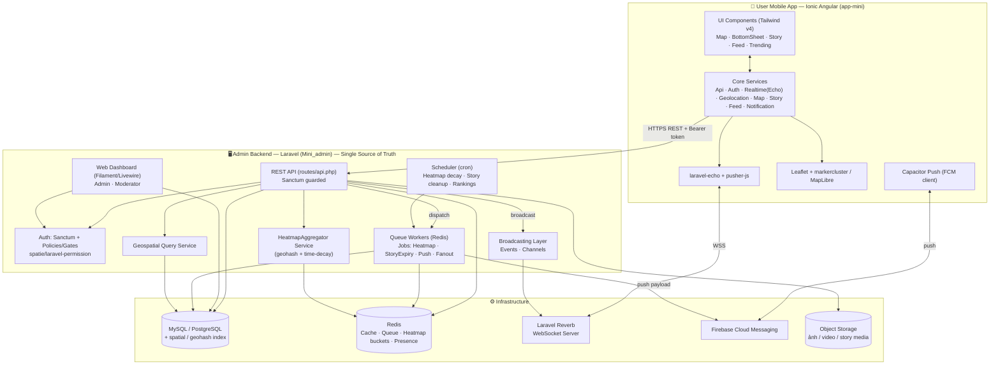
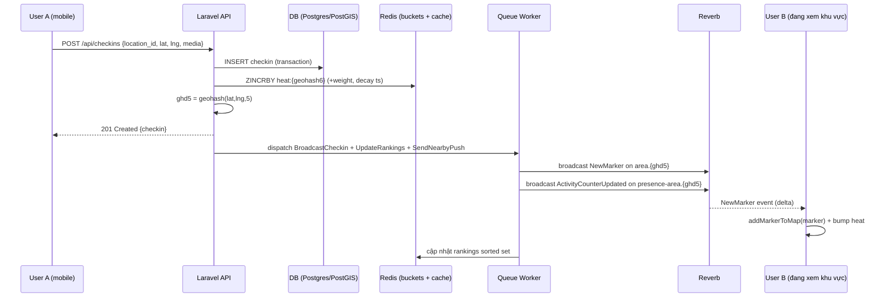
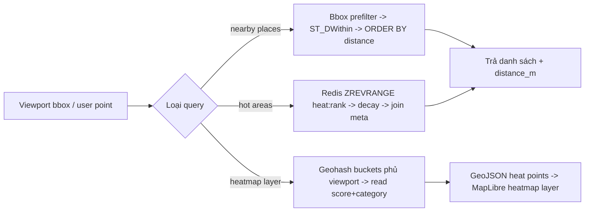
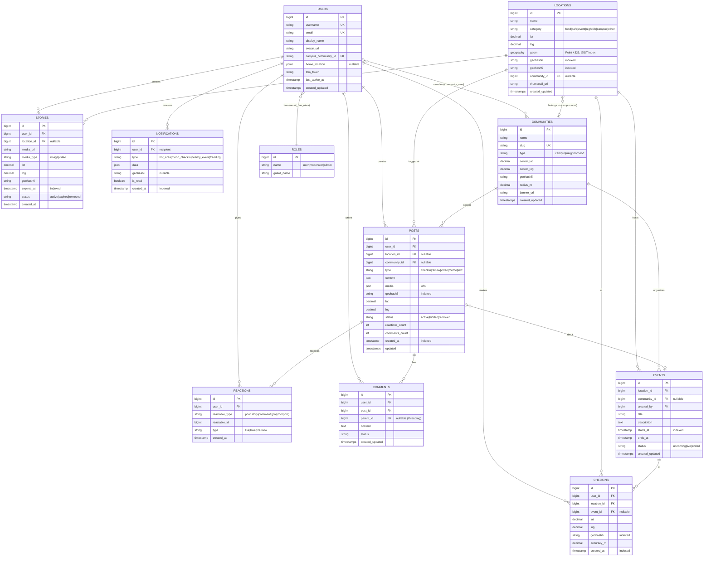
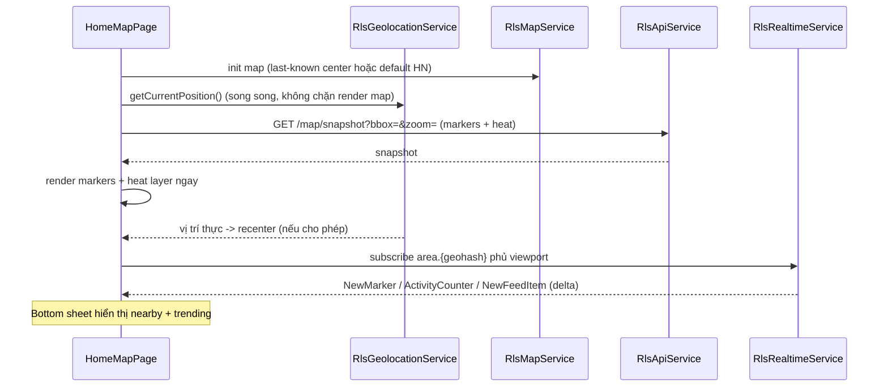

# Tài liệu Thiết kế: Realtime Local Social Platform (`realtime-local-social`)

> Mạng xã hội theo vị trí, realtime cho Gen Z / sinh viên. Trọng tâm là **"Bản đồ Cộng đồng Realtime"**: mở app là thấy ngay bản đồ toàn màn hình hiển thị khu vực đang "hot", mật độ hoạt động, check-in, tin tức theo khu vực và cộng đồng xung quanh. Nội dung được tổ chức theo **VỊ TRÍ** và **HOẠT ĐỘNG THỰC** thay vì theo bạn bè.

Tài liệu này gồm cả **High-Level Design** (kiến trúc hệ thống, sơ đồ, components, data models) và **Low-Level Design** (pseudocode/code, thuật toán, chữ ký hàm). Ngôn ngữ code: **PHP/Laravel** cho backend và **TypeScript/Angular (Ionic)** cho mobile app — theo đúng tech stack đã chốt.

---

## Mục lục

1. [Overview](#overview)
2. [Architecture — Kiến trúc tổng thể](#architecture)
3. [Realtime Architecture (Reverb)](#realtime-architecture-reverb)
4. [Geospatial & Heatmap Design](#geospatial--heatmap-design)
5. [Data Models](#data-models)
6. [Components and Interfaces](#components-and-interfaces)
7. [API Surface (REST)](#api-surface-rest)
8. [Realtime Event Contracts](#realtime-event-contracts)
9. [Roles & Permissions](#roles--permissions)
10. [Mobile App Design (`app-mini`)](#mobile-app-design-app-mini)
11. [Admin Dashboard Design (Laravel)](#admin-dashboard-design-laravel)
12. [Low-Level Design: Thuật toán & Chữ ký hàm](#low-level-design-thuật-toán--chữ-ký-hàm)
13. [Correctness Properties](#correctness-properties)
14. [Error Handling](#error-handling)
15. [Testing Strategy](#testing-strategy)
16. [Performance & Security Considerations](#performance--security-considerations)
17. [Dependencies](#dependencies)
18. [Phasing: Phase 1 / 2 / 3](#phasing-phase-1--2--3)

---

## Overview

Hệ thống gồm **hai project** trong một multi-root workspace, hoạt động theo mô hình **single source of truth** ở backend:

- **ADMIN BACKEND** — Laravel (`c:\My BACKEND\Mini_admin`, greenfield): cung cấp REST API (Laravel Sanctum), realtime WebSocket (Laravel Reverb), Queue & Cache (Redis), push notification (Firebase FCM), và **web dashboard** cho Admin/Moderator. Đây là nguồn dữ liệu chuẩn (single source of truth) và là host phát API mà mobile app tiêu thụ.
- **USER MOBILE APP** — Ionic Angular (`c:\My BACKEND\Mini_app`, module mới `src/app/app-mini`): app người dùng cuối với bản đồ realtime, local feed, marker tương tác, story 24h. Lấy `BASE_URL`/`API_URL` từ admin host qua `environment.ts` hiện có, **không hardcode URL riêng**.

Luồng trải nghiệm cốt lõi: **mở app → thấy bản đồ ngay → bottom sheet nhanh → ít chuyển trang**. Backend tổng hợp mật độ hoạt động theo **geohash bucket + Redis + time-decay** để vẽ heatmap và phát các sự kiện realtime (live marker, live feed, live activity counter, realtime notification) qua các kênh Reverb theo khu vực (area channels / presence channels).

Triết lý phân kỳ: **Phase 1 (MVP)** tập trung realtime map + local feed + marker interaction (xây được ngay). **Phase 2** thêm AI recommendation, campus community, realtime events. **Phase 3** mở rộng social commerce, local advertising, creator/community system.

---

## Architecture

> Kiến trúc tổng thể (High-Level Architecture).



### 2.1 Nguyên tắc kiến trúc

- **Backend là single source of truth.** Mobile app không giữ business logic về xếp hạng/độ hot; chỉ render dữ liệu đã tính.
- **Tách lớp đọc/ghi heatmap.** Ghi hoạt động (check-in, post, reaction) đẩy vào Redis bucket theo geohash; đọc heatmap lấy snapshot đã tổng hợp → tránh quét bảng lớn realtime.
- **Realtime đẩy delta, không đẩy toàn bộ.** Reverb chỉ broadcast thay đổi (marker mới, +1 counter, post mới) trong phạm vi khu vực mà client đang subscribe.
- **Env-driven URL.** App-mini dùng `BASE_URL`/`API_URL` từ `environment.ts` (đang trỏ admin host) và `.env` qua `dotenv-webpack`. Không tạo URL tách rời.

### 2.2 Lựa chọn công nghệ được khuyến nghị (rationale)

| Hạng mục | Khuyến nghị | Lý do |
|---|---|---|
| Admin Web UI | **Filament v3** (trên Livewire) | Greenfield, dựng CRUD + moderation queue + analytics widget rất nhanh, native Laravel, tích hợp policy/permission sẵn. Blade+Tailwind thuần tốn thời gian hơn cho dashboard nghiệp vụ. |
| Map engine (mobile) | **MapLibre GL** cho heatmap + **Leaflet + markercluster** fallback | MapLibre có heatmap layer GPU-accelerated mượt cho mật độ điểm lớn; Leaflet.markercluster mạnh cho gom marker ảnh. Cả hai đã cài. Khuyến nghị MapLibre cho layer heatmap, Leaflet cho marker ảnh custom nếu cần DOM marker. |
| DB | **PostgreSQL + PostGIS** (ưu tiên) hoặc MySQL 8 spatial | PostGIS mạnh nhất cho truy vấn không gian (`ST_DWithin`, GiST index). MySQL 8 cũng có `POINT` + spatial index nếu team quen MySQL. |
| Realtime | **Laravel Reverb** | Native Laravel WS, dùng giao thức Pusher → tương thích `laravel-echo` + `pusher-js` đã cài ở mobile. |
| Permission | **spatie/laravel-permission** | Chuẩn de-facto cho role/permission, tích hợp Gate/Policy. |

---

## Realtime Architecture (Reverb)

Realtime dựa trên **Laravel Reverb** (giao thức Pusher), client dùng `laravel-echo` + `pusher-js`. Mô hình kênh tổ chức theo **khu vực địa lý (geohash)** và **cộng đồng** để client chỉ nhận sự kiện liên quan vùng đang xem.

### 3.1 Mô hình kênh (Channels)

| Kênh | Loại | Mục đích | Phase |
|---|---|---|---|
| `area.{geohash5}` | public/presence | Live marker, live feed, live activity counter trong ô geohash (~precision 5 ≈ 4.9km). Client subscribe theo các ô đang nằm trong viewport. | 1 |
| `area.{geohash6}` | public | Mức zoom cao hơn (~1.2km) cho heatmap chi tiết khi user zoom in. | 1 |
| `community.{communityId}` | public | Feed/trend/event của một cộng đồng (campus). | 2 |
| `presence-area.{geohash5}` | presence | Đếm số người đang "online tại khu vực" (live activity counter dựa member count). | 1 |
| `private-user.{userId}` | private | Notification riêng (check-in của bạn bè, reply, mention). | 1 |
| `event.{eventId}` | public | Countdown / cập nhật sự kiện realtime. | 2 |

> **Viewport subscription:** Khi bản đồ di chuyển, client tính danh sách geohash phủ viewport (xem `coverViewportWithGeohash`) và subscribe/unsubscribe chênh lệch (diff) để giới hạn số kênh (giới hạn cứng, ví dụ tối đa 12 ô; nếu vượt → hạ precision).

### 3.2 Luồng broadcast (live marker / counter)



### 3.3 Đảm bảo realtime

- **At-least-once + idempotent client.** Mỗi event mang `id` (uuid). Client giữ một LRU set các `id` đã xử lý để chống render trùng (do reconnect/replay).
- **Reconnect resync.** Khi `pusher:connection` chuyển sang `connected` lại, client gọi REST snapshot (`GET /api/map/snapshot?bbox=...`) để đồng bộ trạng thái, rồi tiếp tục nhận delta.
- **Backpressure.** Activity counter dùng **debounce broadcast** (gộp các +1 trong cửa sổ ~1s) để tránh bão sự kiện ở khu vực cực hot.

---

## Geospatial & Heatmap Design

### 4.1 Geohash bucketing

Mỗi điểm `(lat, lng)` được mã hóa thành **geohash** ở nhiều precision. Heatmap dùng các ô geohash làm "bucket" — mọi hoạt động rơi vào ô được cộng dồn trọng số.

| Precision | Kích thước ô (xấp xỉ) | Dùng cho |
|---|---|---|
| 4 | ~39 km × 19.5 km | Heatmap zoom rất xa (city level) |
| 5 | ~4.9 km × 4.9 km | Kênh realtime mặc định, heatmap city |
| 6 | ~1.2 km × 0.6 km | Heatmap khu vực, "hot area" |
| 7 | ~153 m × 153 m | Cluster marker / "nearby" mịn |

### 4.2 Heatmap score với time-decay

Độ "hot" của một ô không cố định — hoạt động cũ phải **giảm dần theo thời gian** (time-decay) để bản đồ phản ánh hiện trạng. Dùng **exponential decay**:

```
score(bucket, t_now) = Σ_i  w_i · exp( -λ · (t_now − t_i) )
```

- `w_i`: trọng số sự kiện (check-in=3, post=2, reaction=1, story=2 — cấu hình được).
- `λ`: hằng số phân rã, `λ = ln(2) / halfLife`. Mặc định `halfLife = 1800s` (30 phút) → sau 30 phút, đóng góp của 1 sự kiện còn một nửa.
- `t_i`: timestamp sự kiện; `t_now`: thời điểm đọc.

**Tối ưu lưu trữ (incremental decay):** Không lưu từng sự kiện. Mỗi bucket lưu một cặp `(scoreAtRef, refTs)` trong Redis hash. Khi có sự kiện mới tại `t_new`:

```
scoreAtRef_new = scoreAtRef_old · exp(-λ · (t_new − refTs_old)) + w_new
refTs_new      = t_new
```

Đọc score tại `t_now`: `scoreAtRef · exp(-λ · (t_now − refTs))`. Cách này cho phép cập nhật O(1) và đọc O(1) mỗi bucket, không cần lưu lịch sử.

### 4.3 Phân loại màu heatmap

Màu được suy ra từ **loại hoạt động trội** trong bucket (giữ thêm sub-score theo category), không chỉ từ tổng score:

| Màu | Ý nghĩa | Category trội |
|---|---|---|
| 🔴 Đỏ | Very hot (mật độ cao) | tổng score vượt ngưỡng `HOT_THRESHOLD` |
| 🔵 Xanh dương | Chill / cafe | `cafe` |
| 🟣 Tím | Nightlife | `nightlife` |
| 🟢 Xanh lá | Event | `event` |
| 🟡 Vàng | Trend | `trend` |

### 4.4 Truy vấn "nearby" và "hot areas"

- **Nearby (PostGIS):** dùng cột `geography(Point)` + GiST index, truy vấn `ST_DWithin(location, :point, :radius_m)` rồi `ORDER BY ST_Distance`. Với MySQL 8: cột `POINT SRID 4326` + `ST_Distance_Sphere` + spatial index, lọc trước bằng bounding box.
- **Bounding-box prefilter:** Luôn lọc theo bbox (min/max lat-lng từ viewport) trước khi tính khoảng cách chính xác — tận dụng index, giảm tập ứng viên.
- **Hot areas:** đọc top-N bucket từ Redis sorted set `heat:rank:{geohashPrefix}` (đã decay), join metadata location.



---

## Data Models

> Bao gồm ER Diagram và chiến lược index.

### 5.1 ER Diagram



### 5.2 Index strategy (tóm tắt)

| Bảng | Index quan trọng | Lý do |
|---|---|---|
| `locations` | GiST/spatial trên `geom`; B-tree trên `geohash6`, `geohash5`, `category` | nearby + hot area + filter loại |
| `posts` | composite `(geohash6, created_at DESC)`; `(community_id, created_at DESC)`; `(location_id, created_at DESC)` | local feed theo khu vực / cộng đồng / địa điểm |
| `checkins` | `(geohash6, created_at DESC)`; `(user_id, created_at DESC)`; `(location_id, created_at DESC)` | tổng hợp heatmap + lịch sử |
| `stories` | `(expires_at)` partial WHERE status='active'; `(geohash6, status)` | job dọn hết hạn + story map |
| `notifications` | `(user_id, is_read, created_at DESC)` | inbox người dùng |
| `reactions` | unique `(user_id, reactable_type, reactable_id)`; `(reactable_type, reactable_id)` | chống react trùng + đếm |
| `events` | `(starts_at)`, `(community_id, starts_at)`, `(status)` | sự kiện sắp diễn / theo cộng đồng |

> Cột `geohashN` được tính ở tầng app (model `saving` event / observer) từ `lat,lng` để truy vấn nhanh mà không phụ thuộc DB function.

---

## Components and Interfaces

> Bề mặt API (REST), hợp đồng sự kiện realtime, phân rã service/component của backend và mobile app được mô tả trong các mục con bên dưới (API Surface, Realtime Event Contracts, Mobile App Design, Admin Dashboard Design).

## API Surface (REST)

Tất cả endpoint dưới prefix `/api`, bảo vệ bằng **Sanctum** (Bearer token) trừ các endpoint công khai đánh dấu *(public)*. Response chuẩn JSON `{ data, meta?, message? }`.

### 6.1 Auth (`/api/auth`)

| Method | Endpoint | Mô tả | Phase |
|---|---|---|---|
| POST | `/auth/register` *(public)* | Đăng ký | 1 |
| POST | `/auth/login` *(public)* | Đăng nhập → trả Sanctum token | 1 |
| POST | `/auth/google` *(public)* | Đăng nhập Google (đã có GOOGLE_CLIENT_ID) | 1 |
| POST | `/auth/logout` | Thu hồi token hiện tại | 1 |
| GET | `/auth/me` | Thông tin user hiện tại + role | 1 |
| POST | `/auth/fcm-token` | Lưu/cập nhật FCM token cho push | 1 |

### 6.2 Map & Geospatial (`/api/map`)

| Method | Endpoint | Mô tả | Phase |
|---|---|---|---|
| GET | `/map/snapshot?bbox=&zoom=` | Snapshot markers + heat trong viewport (dùng khi mở app / resync) | 1 |
| GET | `/map/heatmap?bbox=&precision=` | GeoJSON điểm heat (score + category đã decay) | 1 |
| GET | `/map/markers?bbox=&types=` | Danh sách marker ảnh trong viewport | 1 |
| GET | `/map/nearby?lat=&lng=&radius=&types=` | Địa điểm gần (sắp xếp theo khoảng cách) | 1 |
| GET | `/map/hot-areas?bbox=&limit=` | Khu vực hot (top buckets) | 1 |

### 6.3 Locations (`/api/locations`)

| Method | Endpoint | Mô tả | Phase |
|---|---|---|---|
| GET | `/locations/{id}` | Chi tiết địa điểm + stats | 1 |
| GET | `/locations/{id}/feed` | Feed của địa điểm | 1 |
| POST | `/locations` *(mod/admin)* | Tạo địa điểm | 1 |
| PUT/DELETE | `/locations/{id}` *(mod/admin)* | Sửa/xóa | 1 |

### 6.4 Feed & Posts (`/api/posts`, `/api/feed`)

| Method | Endpoint | Mô tả | Phase |
|---|---|---|---|
| GET | `/feed?scope=area|community|location&ref=&cursor=` | Local feed phân trang cursor | 1 |
| POST | `/posts` | Tạo post (check-in photo / video / review / meme) | 1 |
| GET | `/posts/{id}` | Chi tiết post | 1 |
| DELETE | `/posts/{id}` | Xóa post của mình | 1 |
| POST | `/posts/{id}/reactions` | React | 1 |
| DELETE | `/posts/{id}/reactions` | Bỏ react | 1 |
| GET | `/posts/{id}/comments` | Danh sách comment | 1 |
| POST | `/posts/{id}/comments` | Thêm comment | 1 |

### 6.5 Check-ins (`/api/checkins`)

| Method | Endpoint | Mô tả | Phase |
|---|---|---|---|
| POST | `/checkins` | Check-in tại địa điểm (tăng heat + broadcast) | 1 |
| GET | `/checkins/me` | Lịch sử check-in của tôi | 1 |

### 6.6 Stories (`/api/stories`)

| Method | Endpoint | Mô tả | Phase |
|---|---|---|---|
| POST | `/stories` | Đăng story (mặc định hết hạn sau 24h) | 1 |
| GET | `/stories/nearby?lat=&lng=&radius=` | Story gần đang còn hiệu lực | 1 |
| GET | `/stories/map?bbox=` | Story trên bản đồ | 1 |
| GET | `/stories/{id}` | Xem story (tăng view) | 1 |

### 6.7 Trending & Ranking (`/api/trending`)

| Method | Endpoint | Mô tả | Phase |
|---|---|---|---|
| GET | `/trending/nearby?lat=&lng=` | Hot/viral spots gần bạn | 1 |
| GET | `/trending/places?scope=` | Top hot places | 1 |
| GET | `/trending/campus?community=` | Campus active ranking | 2 |

### 6.8 Communities & Events (`/api/communities`, `/api/events`)

| Method | Endpoint | Mô tả | Phase |
|---|---|---|---|
| GET | `/communities` | Danh sách cộng đồng/campus | 2 |
| GET | `/communities/{slug}` | Board + trend + hot places | 2 |
| POST | `/communities/{id}/join` | Tham gia | 2 |
| GET | `/events?scope=&community=` | Sự kiện sắp tới / live | 2 |
| POST | `/events` *(mod/admin)* | Tạo sự kiện | 2 |

### 6.9 Notifications & Recommendation

| Method | Endpoint | Mô tả | Phase |
|---|---|---|---|
| GET | `/notifications?cursor=` | Inbox | 1 |
| POST | `/notifications/{id}/read` | Đánh dấu đã đọc | 1 |
| POST | `/notifications/read-all` | Đọc tất cả | 1 |
| GET | `/recommendations/daily?lat=&lng=` | "Hôm nay đi đâu / ăn gì" (stub Phase 1, AI Phase 2) | 2 |

---

## Realtime Event Contracts

Tên event broadcast (`broadcastAs`) và payload. Client lắng nghe qua Echo.

### 7.1 Trên kênh `area.{geohash5}` / `area.{geohash6}`

```typescript
// .NewMarker — marker mới xuất hiện (post/checkin/story tạo marker)
interface NewMarkerEvent {
  id: string;            // uuid sự kiện (idempotency)
  markerId: string;
  type: 'food' | 'cafe' | 'event' | 'hot_area' | 'campus' | 'user' | 'post';
  lat: number;
  lng: number;
  thumbnailUrl: string;
  label?: string;
  badge?: { kind: 'countdown' | 'count'; value: string };
  createdAt: string;     // ISO8601
}

// .ActivityCounterUpdated — cập nhật live activity counter (debounced)
interface ActivityCounterEvent {
  id: string;
  geohash6: string;
  activeCount: number;   // số hoạt động trong cửa sổ gần đây
  heatScore: number;     // score đã decay
  category: 'food' | 'cafe' | 'event' | 'nightlife' | 'trend' | null;
}

// .NewFeedItem — bài mới cho local feed của khu vực
interface NewFeedItemEvent {
  id: string;
  postId: number;
  type: 'checkin' | 'review' | 'video' | 'meme' | 'text';
  authorName: string;
  authorAvatar: string;
  thumbnailUrl?: string;
  excerpt: string;
  locationName?: string;
  createdAt: string;
}
```

### 7.2 Trên kênh `presence-area.{geohash5}`

```typescript
// presence: here / joining / leaving → suy ra "X người đang ở khu vực"
interface AreaPresenceMember {
  userId: number;
  displayName: string;
  avatarUrl: string;
}
```

### 7.3 Trên kênh `private-user.{userId}`

```typescript
// .NotificationReceived
interface NotificationEvent {
  id: string;
  type: 'hot_area' | 'friend_checkin' | 'nearby_event' | 'trending';
  title: string;
  body: string;
  data: Record<string, unknown>;  // deep-link payload (locationId, eventId...)
  createdAt: string;
}
```

### 7.4 Trên kênh `event.{eventId}`

```typescript
// .EventUpdated — countdown / trạng thái sự kiện (Phase 2)
interface EventUpdatedEvent {
  id: string;
  eventId: number;
  status: 'upcoming' | 'live' | 'ended';
  startsInSeconds?: number;
  attendeesCount: number;
}
```

---

## Roles & Permissions

Dùng **spatie/laravel-permission** + Sanctum. Ba role: `user`, `moderator`, `admin`.

```mermaid
graph TD
    A[Request + Sanctum token] --> B[auth:sanctum middleware]
    B --> C{Route type}
    C -->|API user action| D[Policy check: PostPolicy / CheckinPolicy / StoryPolicy]
    C -->|Moderation API| E[Gate: 'moderate' -> role moderator|admin]
    C -->|Admin dashboard| F[Filament Panel + role:admin / role:moderator]
    D --> G{Allowed?}
    E --> G
    F --> G
    G -->|yes| H[Controller / Resource]
    G -->|no| I[403 Forbidden]
```

### 8.1 Ma trận quyền

| Hành động | user | moderator | admin |
|---|---|---|---|
| Đăng post / story / check-in / react / comment | ✅ (của mình) | ✅ | ✅ |
| Sửa/xóa nội dung **của mình** | ✅ | ✅ | ✅ |
| Ẩn/xóa nội dung **của người khác** | ❌ | ✅ | ✅ |
| Xử lý report (moderation queue) | ❌ | ✅ | ✅ |
| Tạo/sửa địa điểm, sự kiện | ❌ | ✅ | ✅ |
| Quản lý community/campus | ❌ | ⚠️ (được phân công) | ✅ |
| Quản lý user, gán role | ❌ | ❌ | ✅ |
| Analytics toàn hệ thống | ❌ | ⚠️ (phạm vi) | ✅ |
| Cấu hình hệ thống | ❌ | ❌ | ✅ |

### 8.2 Permission invariants (enforce)

- **Ownership rule:** user chỉ mutate được resource có `user_id === auth()->id()` (trừ moderator/admin).
- **Privilege monotonicity:** `admin ⊇ moderator ⊇ user` về quyền — bất kỳ hành động user làm được thì moderator/admin cũng làm được.
- **Mọi route ghi đều qua policy/gate** — không có "naked" mutation.

---

## Mobile App Design (`app-mini`)

### 9.1 Tích hợp vào routing hiện có

Thêm lazy route top-level **mới** vào `src/app/app-routing.module.ts`, song song `gap-move` và `bro-jet`, **không động** các route hiện có:

```typescript
// app-routing.module.ts — thêm vào mảng routes (KHÔNG sửa gap-move/bro-jet)
{
  path: 'app-mini',
  loadChildren: () =>
    import('./app-mini/app-mini.module').then((m) => m.AppMiniModule),
},
```

> Giữ nguyên `redirectTo: 'gap-move'` mặc định. App-mini truy cập qua `/app-mini`.

### 9.2 Cấu trúc thư mục (mirror `bro-jet`)

```
src/app/app-mini/
├── app-mini.module.ts
├── app-mini-routing.module.ts
├── core/
│   ├── constants/        # rls-config.constants.ts (heat weights, geohash precision...)
│   ├── guards/           # rls-auth.guard.ts
│   ├── interceptors/     # rls-auth.interceptor.ts (mirror BjAuthInterceptor)
│   ├── interfaces/       # location, post, story, marker, heat, event...
│   ├── services/         # xem 9.4
│   └── utils/            # geohash.util.ts, distance.util.ts, decay.util.ts
├── features/
│   ├── map/              # logic bản đồ realtime (Phase 1)
│   ├── feed/             # local feed (Phase 1)
│   ├── story/            # story 24h (Phase 1)
│   ├── community/        # campus community (Phase 2)
│   └── events/           # realtime events (Phase 2)
├── layout/
│   ├── rls-layout/       # shell: map full-screen + bottom sheet host
│   ├── rls-header/       # search bar + notification bell
│   └── rls-footer/       # tab bar (Map · Feed · Story · Notifications · Profile)
├── pages/
│   ├── home-map/         # màn chính: bản đồ toàn màn hình
│   ├── local-feed/
│   ├── location-detail/
│   ├── story-viewer/
│   ├── trending/
│   ├── community/        # Phase 2
│   ├── notifications/
│   └── profile/
├── shared/
│   ├── components/       # xem 9.3 (các component nhỏ tái sử dụng)
│   ├── constants/
│   ├── icons/
│   ├── pipes/            # time-ago.pipe.ts, distance.pipe.ts
│   └── styles/           # neon/glassmorphism Tailwind utilities
└── tests/                # property-based tests (fast-check)
```

### 9.3 Component breakdown (nhỏ, tái sử dụng — Tailwind v4)

User yêu cầu "tách thành các thành phần nhỏ". Các presentational component standalone:

| Component | Trách nhiệm | Input/Output chính |
|---|---|---|
| `RlsMapMarkerComponent` | Render 1 marker ảnh (glow/pulse theo type) | `@Input marker: MapMarker` · `@Output tap` |
| `RlsHeatLayerComponent` | Quản lý heatmap layer (MapLibre) | `@Input heatPoints: HeatPoint[]` |
| `RlsBottomSheetComponent` | Bottom sheet kéo nhanh (snap points) | `@Input snap` · `@Output snapChange` |
| `RlsStoryRingComponent` | Vòng story (gradient ring, seen state) | `@Input story` · `@Output open` |
| `RlsStoryMapPinComponent` | Pin story trên bản đồ | `@Input story` |
| `RlsFeedCardComponent` | Card 1 item feed (check-in/review/video/meme) | `@Input post` · `@Output react/comment` |
| `RlsTrendingCardComponent` | Card địa điểm trending | `@Input place` · `@Output open` |
| `RlsNearbyPanelComponent` | Panel "gần bạn" trong bottom sheet | `@Input places` |
| `RlsTrendingPanelComponent` | Panel trending | `@Input items` |
| `RlsSearchBarComponent` | Thanh tìm kiếm glassmorphism | `@Output query` |
| `RlsActivityCounterComponent` | Live counter "X đang hoạt động" | `@Input count` `@Input heatScore` |
| `RlsMarkerClusterComponent` | Cụm marker (campus cluster anim) | `@Input cluster` |
| `RlsNeonBadgeComponent` | Badge countdown/count neon | `@Input badge` |
| `RlsReactionBarComponent` | Thanh reaction (like/love/fire/wow) | `@Output react` |

> Style: dark mode + neon glow + glassmorphism nhẹ qua Tailwind v4 utilities trong `shared/styles`. Swiper.js cho story/carousel.

### 9.4 Core services

| Service | Trách nhiệm | Phase |
|---|---|---|
| `RlsApiService` | Wrapper HTTP (mirror `BjApiService`), dùng `API_URL` từ `environment.ts` | 1 |
| `RlsAuthService` | Login/register/Google, lưu token (`rls_access_token`), `currentUser$` | 1 |
| `RlsRealtimeService` (EchoService) | Khởi tạo `laravel-echo` + `pusher-js` → Reverb; quản lý subscribe/unsubscribe kênh theo viewport; idempotency LRU | 1 |
| `RlsGeolocationService` | Wrapper `@capacitor/geolocation`, watch vị trí, permission | 1 |
| `RlsMapService` | State bản đồ (center, zoom, bbox, markers, heat) — `BehaviorSubject` (mirror `BjMapService`) | 1 |
| `RlsFeedService` | Tải local feed (cursor), merge realtime feed items | 1 |
| `RlsStoryService` | Đăng/tải story, lọc hết hạn phía client, story map | 1 |
| `RlsNotificationService` | Inbox + realtime + Capacitor push (FCM) | 1 |
| `RlsTrendingService` | Nearby trending / hot places / rankings | 1 |
| `RlsCommunityService` | Campus community board/trend | 2 |
| `RlsRecommendationService` | Daily suggestion (stub → AI) | 2 |
| `RlsToastService` | Toast/feedback (mirror `BjToastService`) | 1 |

### 9.5 Auth interceptor (mirror `BjAuthInterceptor`)

`RlsAuthInterceptor` gắn `Authorization: Bearer <rls_access_token>`, xử lý 401: xóa token, chỉ redirect `/app-mini/login` khi đang ở route protected (feed cá nhân, profile, đăng bài...), bỏ qua route public (home-map, trending). Đăng ký trong `app-mini.module.ts` (provider `HTTP_INTERCEPTORS`, multi: true) để scope theo module, không ảnh hưởng `gap-move`/`bro-jet`.

### 9.6 Luồng khởi động app (mở app → thấy bản đồ ngay)



---

## Admin Dashboard Design (Laravel)

Khuyến nghị **Filament v3** cho dashboard (Admin + Moderator) vì greenfield và cần CRUD + moderation + analytics nhanh, native Laravel.

### 10.1 Cấu trúc backend (Mini_admin)

```
app/
├── Models/                  # User, Location, Post, Story, Checkin, Reaction,
│                            # Comment, Notification, Community, Event, Report
├── Http/
│   ├── Controllers/Api/     # AuthController, MapController, FeedController,
│   │                        # PostController, CheckinController, StoryController,
│   │                        # TrendingController, CommunityController,
│   │                        # EventController, NotificationController
│   ├── Requests/            # FormRequest validation
│   ├── Resources/           # API Resources (JSON transform)
│   └── Middleware/
├── Policies/                # PostPolicy, StoryPolicy, CheckinPolicy, CommentPolicy
├── Services/
│   ├── HeatmapAggregator.php
│   ├── GeospatialQueryService.php
│   ├── GeohashService.php
│   ├── RankingService.php
│   └── RecommendationService.php   # Phase 2
├── Events/                  # NewMarker, ActivityCounterUpdated, NewFeedItem,
│                            # NotificationReceived, EventUpdated
├── Jobs/                    # BroadcastCheckin, UpdateRankings, SendNearbyPush,
│                            # ExpireStories, RecomputeHeatmapDecay, FanoutFeed
├── Observers/               # LocationObserver, PostObserver (tính geohash)
└── Filament/
    ├── Resources/           # UserResource, PostResource, LocationResource,
    │                        # CommunityResource, EventResource, ReportResource
    ├── Pages/               # ModerationQueue, AnalyticsDashboard
    └── Widgets/             # ActiveUsersWidget, HotAreasWidget,
                             # TrendingPlacesWidget, ReportsBacklogWidget
```

### 10.2 Module dashboard

| Module | Chức năng | Role |
|---|---|---|
| **User Management** | List/search user, gán role, ban/unban | admin |
| **Moderation Queue** | Hàng đợi report (post/story/comment), duyệt/ẩn/xóa, ghi audit | moderator, admin |
| **Content** | Quản lý post/story/comment | moderator, admin |
| **Locations** | CRUD địa điểm, gán category, gắn community | moderator, admin |
| **Communities/Campus** | CRUD cộng đồng, gán moderator phụ trách | admin (mod theo phân công) |
| **Events** | CRUD sự kiện, đặt trạng thái | moderator, admin |
| **Analytics** | DAU/MAU, hot areas, trending places, check-in volume, retention | admin (mod theo phạm vi) |

### 10.3 Scheduler & Queue (kernel)

| Job | Lịch / Trigger | Nhiệm vụ | Phase |
|---|---|---|---|
| `ExpireStories` | mỗi 5 phút | đánh dấu `status='expired'` cho story quá `expires_at` | 1 |
| `RecomputeHeatmapDecay` | mỗi 1 phút | snapshot lại sorted set ranking sau decay (cho hot areas) | 1 |
| `UpdateRankings` | sau mỗi activity (queued) | cập nhật ranking places/campus | 1 |
| `SendNearbyPush` | event-driven | gửi FCM cho user gần khi có hot area / event | 1 |
| `BroadcastCheckin`/`FanoutFeed` | event-driven | broadcast realtime delta | 1 |
| `ComputeDailySuggestion` | hằng ngày | tạo gợi ý "hôm nay đi đâu" | 2 |

---

## Low-Level Design: Thuật toán & Chữ ký hàm

Phần này dùng **PHP/Laravel** (backend) và **TypeScript** (mobile), kèm pseudocode thuật toán khi cần. Mỗi hàm trọng yếu có **Preconditions / Postconditions / Invariants**.

### 11.1 GeohashService (encode + viewport cover)

```php
final class GeohashService
{
    private const BASE32 = '0123456789bcdefghjkmnpqrstuvwxyz';

    /**
     * Mã hóa (lat,lng) thành geohash độ dài $precision.
     * Pre:  -90 <= lat <= 90, -180 <= lng <= 180, 1 <= precision <= 12
     * Post: strlen(result) == precision, mọi ký tự thuộc BASE32
     */
    public function encode(float $lat, float $lng, int $precision): string;

    /**
     * Trả về bounding box [minLat, minLng, maxLat, maxLng] của ô geohash.
     * Post: point gốc của hash luôn nằm trong bbox trả về (containment).
     */
    public function bounds(string $hash): array;

    /**
     * Liệt kê các geohash (ở precision cho trước) phủ một bbox viewport.
     * Pre:  bbox hợp lệ (minLat<=maxLat, minLng<=maxLng)
     * Post: hợp của bounds(mỗi hash) phủ toàn bộ bbox đầu vào
     *       |result| <= maxCells (nếu vượt -> caller giảm precision)
     */
    public function coverBbox(array $bbox, int $precision, int $maxCells): array;
}
```

```pascal
ALGORITHM encode(lat, lng, precision)
  latRange ← [-90, 90];  lngRange ← [-180, 180]
  bits ← 0;  bit ← 0;  evenBit ← TRUE;  hash ← ""
  WHILE length(hash) < precision DO
    IF evenBit THEN              // chia theo kinh độ (lng)
      mid ← (lngRange.low + lngRange.high) / 2
      IF lng >= mid THEN bits ← (bits<<1)|1; lngRange.low ← mid
      ELSE bits ← (bits<<1)|0; lngRange.high ← mid
    ELSE                          // chia theo vĩ độ (lat)
      mid ← (latRange.low + latRange.high) / 2
      IF lat >= mid THEN bits ← (bits<<1)|1; latRange.low ← mid
      ELSE bits ← (bits<<1)|0; latRange.high ← mid
    END IF
    evenBit ← NOT evenBit
    bit ← bit + 1
    IF bit = 5 THEN
      hash ← hash + BASE32[bits];  bits ← 0;  bit ← 0
    END IF
  END WHILE
  RETURN hash
END
```

### 11.2 HeatmapAggregator (incremental time-decay)

```php
final class HeatmapAggregator
{
    public function __construct(
        private Redis $redis,
        private float $lambda,      // = ln(2)/halfLifeSeconds
    ) {}

    /**
     * Cộng một sự kiện vào bucket geohash với trọng số $weight tại thời điểm $now.
     * Lưu trạng thái incremental: hash field {score, refTs} + sub-score theo category.
     * Pre:  weight > 0, now >= refTs hiện tại của bucket
     * Post: readScore(bucket, now) tăng đúng +weight so với trước khi add
     *       (tại cùng mốc thời gian now)
     */
    public function addEvent(string $geohash6, string $category, float $weight, int $now): void;

    /**
     * Đọc score đã decay của bucket tại thời điểm $now.
     * Post: kết quả >= 0; đơn điệu giảm theo (now - refTs) khi không có event mới
     */
    public function readScore(string $geohash6, int $now): float;

    /** Trả category trội (sub-score lớn nhất) hoặc null. */
    public function dominantCategory(string $geohash6, int $now): ?string;

    /** Top-N bucket hot trong tập geohash phủ viewport (đã decay). */
    public function hotBuckets(array $geohashes, int $now, int $limit): array;
}
```

```pascal
ALGORITHM addEvent(geohash6, category, weight, now)
  // decay state cũ về mốc now rồi cộng trọng số
  (scoreOld, refTs) ← redis.hmget("heat:"+geohash6, "score", "refTs")
  IF refTs = NULL THEN scoreOld ← 0; refTs ← now END IF
  decayed ← scoreOld * exp(-lambda * (now - refTs))
  scoreNew ← decayed + weight
  redis.hmset("heat:"+geohash6, score=scoreNew, refTs=now)
  // sub-score theo category (cùng cơ chế decay)
  decayCategoryAndAdd("heatcat:"+geohash6, category, weight, now)
  // cập nhật ranking để hot-areas đọc nhanh
  redis.zadd("heat:rank:"+prefix(geohash6,5), scoreNew, geohash6)
END

ALGORITHM readScore(geohash6, now)
  (score, refTs) ← redis.hmget("heat:"+geohash6, "score", "refTs")
  IF score = NULL THEN RETURN 0 END IF
  RETURN score * exp(-lambda * (now - refTs))
END
```

**Tính chất quan trọng:** với cùng tập sự kiện, `readScore` chỉ phụ thuộc tổng `Σ w_i·exp(-λ(now−t_i))` — bất biến với **thứ tự** add (tính giao hoán của tổng), và **đơn điệu giảm** theo `now` khi không có event mới.

### 11.3 GeospatialQueryService (nearby)

```php
final class GeospatialQueryService
{
    /**
     * Tìm địa điểm trong bán kính radiusM quanh (lat,lng), sắp xếp tăng theo distance.
     * Pre:  radiusM > 0
     * Post: mọi phần tử có distance_m <= radiusM
     *       danh sách sắp xếp không giảm theo distance_m
     *       không bỏ sót location nằm trong bán kính (completeness)
     */
    public function nearby(float $lat, float $lng, float $radiusM, array $types, int $limit): array;
}
```

```pascal
ALGORITHM nearby(lat, lng, radiusM, types, limit)
  // 1) bbox prefilter (dùng index, rẻ)
  dLat ← radiusM / 111320
  dLng ← radiusM / (111320 * cos(radians(lat)))
  bbox ← [lat-dLat, lng-dLng, lat+dLat, lng+dLng]
  candidates ← SELECT * FROM locations
               WHERE lat BETWEEN bbox.minLat AND bbox.maxLat
                 AND lng BETWEEN bbox.minLng AND bbox.maxLng
                 AND (types = [] OR category IN types)
  // 2) lọc chính xác bằng khoảng cách haversine/PostGIS + sắp xếp
  result ← []
  FOR loc IN candidates DO
    d ← haversine(lat, lng, loc.lat, loc.lng)
    IF d <= radiusM THEN result.add({loc, distance_m: d})
  END FOR
  SORT result BY distance_m ASC
  RETURN take(result, limit)
END
```
> Với PostGIS, bước (1)+(2) gộp thành `WHERE ST_DWithin(geom, point, radiusM) ORDER BY geom <-> point LIMIT n` (dùng GiST + KNN). Pseudocode trên là phương án MySQL/portable.

### 11.4 Realtime broadcast flow (check-in)

```php
// CheckinController@store
public function store(StoreCheckinRequest $req): JsonResponse
{
    // Pre:  $req đã validate (location_id tồn tại, lat/lng hợp lệ), user authenticated
    // Post: checkin được lưu; heat bucket tăng; các job broadcast/push được dispatch
    $checkin = DB::transaction(function () use ($req) {
        $c = Checkin::create([...$req->validated(), 'user_id' => auth()->id()]);
        return $c; // observer tự set geohash6
    });

    $now = now()->timestamp;
    app(HeatmapAggregator::class)->addEvent($checkin->geohash6, 'food', 3.0, $now);

    $g5 = substr($checkin->geohash6, 0, 5);
    BroadcastCheckin::dispatch($checkin, $g5);      // -> NewMarker, ActivityCounterUpdated
    UpdateRankings::dispatch($checkin->location_id);
    SendNearbyPush::dispatch($checkin);             // FCM cho user gần

    return CheckinResource::make($checkin)->response()->setStatusCode(201);
}
```

### 11.5 Story 24h expiry (scheduled job)

```php
// Job: ExpireStories (chạy mỗi 5 phút qua scheduler)
public function handle(): void
{
    // Post: mọi story có expires_at <= now và status='active' chuyển sang 'expired'
    //       không story còn hiệu lực nào (expires_at > now) bị đổi trạng thái
    Story::query()
        ->where('status', 'active')
        ->where('expires_at', '<=', now())
        ->chunkById(500, fn ($chunk) =>
            $chunk->each->update(['status' => 'expired'])
        );
}

// Khi tạo story: expires_at = created_at + 24h (bất biến)
// StoryObserver@creating: $story->expires_at ??= $story->freshTimestamp()->addDay();
```

```typescript
// Client lọc story còn hiệu lực (RlsStoryService)
isStoryActive(story: Story, now: number): boolean {
  // Post: true ⟺ now < expires_at && status === 'active'
  return story.status === 'active' && now < Date.parse(story.expiresAt);
}
```

### 11.6 Marker clustering (client)

```typescript
/**
 * Gom marker gần nhau ở mức zoom thấp thành cluster.
 * Pre:  zoom >= 0, markers hữu hạn
 * Post: mỗi marker thuộc đúng 1 cluster (phân hoạch — partition)
 *       Σ cluster.count === markers.length (bảo toàn số lượng)
 *       hai marker cùng cluster có khoảng cách pixel < gridSize
 */
clusterMarkers(markers: MapMarker[], zoom: number, gridSize: number): MarkerCluster[];
```

```pascal
ALGORITHM clusterMarkers(markers, zoom, gridSize)
  grid ← empty map           // key = (cellX, cellY)
  FOR m IN markers DO
    (px, py) ← project(m.lat, m.lng, zoom)
    key ← (floor(px / gridSize), floor(py / gridSize))
    grid[key].append(m)
  END FOR
  clusters ← []
  FOR each cell IN grid DO
    clusters.append({
      lat: avg(cell.lat), lng: avg(cell.lng),
      count: size(cell), members: cell
    })
  END FOR
  RETURN clusters
END
```

### 11.7 Recommendation stub (Phase 2)

```php
final class RecommendationService
{
    /**
     * Phase 1: stub — trả hot areas + nearby trending (không AI).
     * Phase 2: kết hợp location, time-of-day, community trend, interaction history.
     * Post: trả <= limit gợi ý, mỗi gợi ý có lý do (reason) để hiển thị.
     */
    public function dailySuggestion(User $user, float $lat, float $lng, int $limit): array
    {
        // Phase 1 fallback
        return app(RankingService::class)->nearbyTrending($lat, $lng, $limit);
    }
}
```

---

## Correctness Properties

> Property-Based Testing properties.

Các tính chất phổ quát để kiểm thử bằng property-based testing (**fast-check** đã có ở mobile; backend dùng Pest/PHPUnit + generator thủ công hoặc `pestphp/pest-plugin` random).

> **Lưu ý workflow (Design-First):** Tài liệu này được tạo trước bước Requirements. Trường **Validates: Requirements X.Y** của mỗi property sẽ được điền khi phái sinh requirements (EARS) ở bước kế tiếp, ánh xạ từng property tới acceptance criteria tương ứng.

### Property 1: Heatmap score — đơn điệu time-decay
```
∀ bucket b, ∀ t2 > t1 (không có event mới trong [t1, t2]):
    readScore(b, t2) <= readScore(b, t1)
    ∧ readScore(b, t) >= 0
```
Khi không có event mới, score chỉ giảm hoặc bằng, không bao giờ tăng và không âm.

**Validates: Requirements 4.3, 4.6**

### Property 2: Heatmap add — giao hoán & cộng tính tại cùng mốc thời gian
```
∀ tập sự kiện E, ∀ hoán vị π của E (cùng timestamps):
    readScore sau khi add theo thứ tự E  ==  readScore sau khi add theo π(E)   (sai số ε)
∀ event mới (w, now):
    readScore(b, now) sau addEvent  ==  readScore(b, now) trước  +  w           (sai số ε)
```

**Validates: Requirements 4.1, 4.2**

### Property 3: Geohash bucket containment
```
∀ (lat, lng) hợp lệ, ∀ precision p:
    h = encode(lat, lng, p)
    bounds(h).minLat <= lat <= bounds(h).maxLat
    ∧ bounds(h).minLng <= lng <= bounds(h).maxLng
∀ precision p2 < p1:  encode(lat,lng,p2) là prefix của encode(lat,lng,p1)   (prefix monotonicity)
```

**Validates: Requirements 4.1, 4.5**

### Property 4: Viewport cover — phủ kín
```
∀ bbox hợp lệ, ∀ precision p:
    cells = coverBbox(bbox, p, ∞)
    ∀ (lat,lng) ∈ bbox:  ∃ c ∈ cells sao cho (lat,lng) ∈ bounds(c)
```
Mọi điểm trong viewport phải nằm trong ít nhất một ô được trả về (không bỏ sót realtime).

**Validates: Requirements 2.5, 12.1**

### Property 5: Story expiry invariants
```
∀ story s:  s.expires_at == s.created_at + 24h
∀ now:      isStoryActive(s, now) == (s.status=='active' ∧ now < s.expires_at)
sau ExpireStories(now):  ¬∃ s với s.status=='active' ∧ s.expires_at <= now
ExpireStories KHÔNG đổi story có expires_at > now    (không hết hạn sớm)
```

**Validates: Requirements 8.1, 8.2, 8.4**

### Property 6: Nearby distance correctness
```
∀ điểm truy vấn (lat,lng), radius r, tập locations L:
    result = nearby(lat,lng,r,...)
    (soundness)      ∀ x ∈ result:  distance(x) <= r
    (sortedness)     result sắp xếp không giảm theo distance
    (completeness)   ∀ loc ∈ L với distance(loc) <= r ∧ chưa vượt limit:  loc ∈ result
```

**Validates: Requirements 6.1, 6.2, 6.3**

### Property 7: Marker clustering — bảo toàn & phân hoạch
```
∀ markers M, zoom z, gridSize g:
    clusters = clusterMarkers(M, z, g)
    Σ_{c ∈ clusters} c.count == |M|          (bảo toàn số lượng)
    mỗi marker thuộc đúng 1 cluster           (phân hoạch)
```

**Validates: Requirements 3.4**

### Property 8: Permission invariants
```
∀ user u, resource res:
    canMutate(u, res) ⟹ (res.user_id == u.id) ∨ hasRole(u, {moderator, admin})
∀ action a:  user_can(a) ⟹ moderator_can(a) ∧ admin_can(a)   (privilege monotonicity)
```

**Validates: Requirements 1.7, 13.1**

### Property 9: Realtime idempotency
```
∀ event e với id i, áp dụng e nhiều lần ở client:
    state sau khi xử lý e một lần == state sau khi xử lý e n lần   (idempotent render)
```

**Validates: Requirements 3.6, 5.4, 12.4**

---

## Error Handling

| Tình huống | Phát hiện | Xử lý | Phục hồi |
|---|---|---|---|
| Mất kết nối WebSocket | `pusher:connection` `unavailable`/`failed` | Hiển thị badge "đang kết nối lại"; tiếp tục dùng dữ liệu REST | Khi `connected` lại → gọi `/map/snapshot` resync, re-subscribe kênh viewport |
| Từ chối quyền vị trí | `RlsGeolocationService` bắt lỗi permission | Map mặc định center thành phố; cho phép search thủ công | Nhắc cấp quyền khi user bấm "định vị" |
| 401 token hết hạn | `RlsAuthInterceptor` | Xóa token; nếu route protected → `/app-mini/login` | Login lại; giữ `returnUrl` |
| Heat bucket chưa có | `readScore` trả 0 | Coi như khu vực "lạnh" | Tạo lazy khi có event đầu tiên |
| Story đã hết hạn nhưng job chưa chạy | Client `isStoryActive` filter | Ẩn ở client ngay | Job `ExpireStories` dọn DB sau |
| Spam check-in / post (rate) | Middleware `throttle` + kiểm tra khoảng cách/thời gian | 429 + thông báo | Cho thử lại sau cooldown |
| Vị trí giả / nhảy GPS | `accuracy_m` lớn / dịch chuyển bất thường | Gắn cờ, hạ trọng số heat | Moderation review |
| Reverb quá tải khu hot | Debounce + gộp counter | Giảm tần suất broadcast | Tự phục hồi khi mật độ giảm |

---

## Testing Strategy

### 14.1 Unit testing
- **Backend (Pest/PHPUnit):** `GeohashService`, `HeatmapAggregator` (decay/add), `GeospatialQueryService` (nearby), policies/gates, observers (tính geohash), jobs (`ExpireStories`).
- **Mobile (Jasmine/Karma):** services (`RlsRealtimeService` subscribe diff, `RlsStoryService.isStoryActive`, `clusterMarkers`), pipes (time-ago, distance).

### 14.2 Property-based testing
- **Library:** `fast-check` (mobile, đã cài ở devDependencies) cho P3, P4, P5(client), P6, P7, P9. Backend dùng generator ngẫu nhiên trong Pest cho P1, P2, P3, P5(job), P6, P8.
- Đặt test trong `src/app/app-mini/tests/` (mirror `bro-jet/tests/`).

### 14.3 Integration testing
- **API (backend):** feature test cho từng endpoint với Sanctum (auth, ownership, role).
- **Realtime:** test broadcast event đúng kênh khi có check-in/post (fake broadcaster, assert `Event::fake`).
- **Mobile E2E (tùy chọn):** luồng mở app → render snapshot → nhận delta giả lập.

---

## Performance & Security Considerations

### 15.1 Performance
- **Heatmap O(1) read/write** nhờ incremental decay trong Redis; tránh quét bảng `checkins`/`posts` realtime.
- **Bbox prefilter + spatial index** cho nearby; cap `LIMIT` và `radius`.
- **Cursor pagination** cho feed (không OFFSET) để ổn định với dữ liệu realtime.
- **Channel diffing** giới hạn số kênh subscribe; **debounce** activity counter.
- **CDN/object storage** cho media; thumbnail riêng cho marker.
- **Cache** snapshot heatmap theo (bbox bucket, precision) với TTL ngắn (vd 5–10s).

### 15.2 Security
- **Sanctum** cho mọi endpoint ghi; **policies/gates** cho ownership; **spatie/laravel-permission** cho role.
- **Private channel auth** cho `private-user.{id}` và presence — Reverb xác thực qua `/broadcasting/auth` (Sanctum).
- **Rate limiting** (`throttle`) cho check-in/post/comment chống spam.
- **Input validation** qua FormRequest; sanitize nội dung post (chống XSS hiển thị ở dashboard).
- **Quyền riêng tư vị trí:** chỉ lưu/độ chính xác cần thiết; không lộ vị trí chính xác của user khác (chỉ hiển thị marker mức khu vực với story/checkin ẩn danh hóa tùy chọn).
- **PII:** FCM token, email chỉ truy cập qua kênh bảo mật; không log token đầy đủ.
- ⚠️ **Lưu ý:** mọi endpoint realtime/map đọc công khai cần cân nhắc lộ mật độ vị trí — áp dụng làm tròn geohash (không trả tọa độ raw của user) cho dữ liệu nhạy cảm.

---

## Dependencies

### 16.1 Backend (Laravel — Mini_admin, greenfield)
- `laravel/framework`, `laravel/sanctum`, `laravel/reverb`
- `spatie/laravel-permission`
- `filament/filament` (admin dashboard)
- `predis/predis` hoặc `phpredis` (Redis: cache/queue/heatmap)
- `kreait/laravel-firebase` hoặc Laravel notification + FCM channel (push)
- PostgreSQL + PostGIS (ưu tiên) hoặc MySQL 8 spatial
- `pestphp/pest` (test)

### 16.2 Mobile (đã cài sẵn trong `Mini_app/package.json`)
- `@angular/*` 20, `@ionic/angular` 8, `@capacitor/*` 8
- `laravel-echo`, `pusher-js` (realtime → Reverb)
- `leaflet`, `leaflet.markercluster`, `maplibre-gl`, `@vietmap/vietmap-gl-js`, `@turf/circle` (map + heatmap + cluster)
- `swiper` (story/carousel)
- `tailwindcss` v4 (`@tailwindcss/postcss`)
- `@capacitor/geolocation`, `@capacitor/push-notifications`, `firebase`/`@angular/fire`
- `fast-check` (property-based testing — devDependency)
- Env: `dotenv-webpack` + `extra-webpack.config.js` (đã có) → tái sử dụng `BASE_URL`/`API_URL`

> **Không thêm URL hardcode.** App-mini dùng `API_URL` từ `src/environments/environment.ts` (đang trỏ `https://admin-jet.tinopage.com`).

---

## Phasing: Phase 1 / 2 / 3

```mermaid
graph LR
    subgraph P1["🟢 Phase 1 — MVP (xây ngay)"]
        A1[Realtime Map full-screen]
        A2[Image markers + types + heatmap layer]
        A3[Local Feed theo khu vực]
        A4[Check-in + Reactions + Comments]
        A5[Story 24h + story map]
        A6[Realtime: live marker/feed/counter]
        A7[Notifications + FCM push]
        A8[Nearby trending + hot areas]
        A9[Auth Sanctum + Admin dashboard cơ bản + Moderation]
    end
    subgraph P2["🟡 Phase 2"]
        B1[AI Recommendation]
        B2[Campus Community board/trend]
        B3[Realtime Events + countdown]
        B4[Activity Ranking nâng cao]
        B5[Explore Challenge]
    end
    subgraph P3["🔵 Phase 3"]
        C1[Social Commerce]
        C2[Local Advertising]
        C3[Creator / Community system]
    end
    P1 --> P2 --> P3
```



### 17.1 Bảng ánh xạ thành phần ↔ Phase

| Thành phần thiết kế | Phase 1 | Phase 2 | Phase 3 |
|---|:---:|:---:|:---:|
| Home Map + heatmap + markers | ✅ | | |
| Local Feed + Posts + Reactions/Comments | ✅ | | |
| Check-in + Story 24h | ✅ | | |
| Realtime (Reverb area/presence/private channels) | ✅ | (+event channel) | |
| Notifications + FCM | ✅ | | |
| Nearby trending / hot areas | ✅ | (+ranking nâng cao) | |
| Auth Sanctum + Roles/Permissions | ✅ | | |
| Admin dashboard (user/content/location/moderation) | ✅ | (+community/event/analytics mở rộng) | |
| Campus Community | | ✅ | |
| Realtime Events + countdown | | ✅ | |
| AI Recommendation | (stub) | ✅ | |
| Explore Challenge / engagement nâng cao | | ✅ | |
| Social Commerce / Local Ads / Creator | | | ✅ |

### 17.2 Định nghĩa "Done" cho Phase 1 (MVP)
- Mở app → bản đồ toàn màn hình render snapshot < 2s.
- Marker ảnh theo type + heatmap layer hiển thị mật độ có time-decay.
- Local feed theo khu vực + đăng check-in/post + react/comment.
- Story 24h hết hạn tự động (job) + hiển thị nearby/story map.
- Realtime: marker/feed/counter cập nhật trực tiếp qua Reverb.
- Notification realtime + push FCM cho hot area/nearby event.
- Admin/Moderator đăng nhập dashboard, duyệt report, quản lý nội dung/địa điểm.

---

> **Bước tiếp theo trong workflow:** từ design này sẽ phái sinh **requirements** (EARS) rồi đến **tasks**. Phần Correctness Properties (mục 12) sẽ là đầu vào cho property-based testing khi lập tasks.
